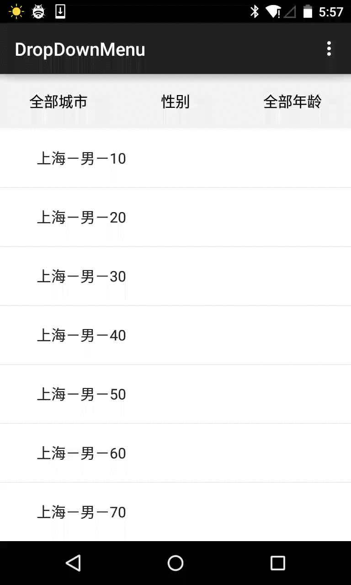

# DropDownMenu

[](http://android-arsenal.com/details/1/1753)

DropDownMenu for Android,Filter the list based on multiple condition.



 To get this project into your build
----------

Step 1. Add the specific repository to your build file:

```
repositories {
    maven {
        url "https://jitpack.io"
    }
}
```
Step 2. Add the dependency in your build file (do not forget to specify the correct qualifier, usually 'aar'):

```
dependencies {
    compile 'com.github.JayFang1993:DropDownMenu:3e8620dc99'
}
```
That's it!
Provided by：Android Arsenal

Usage
----
```
    <com.jayfang.dropdownmenu.DropDownMenu
        android:orientation="horizontal"
        android:layout_width="fill_parent"
        android:id="@+id/menu"
        android:background="@color/white"
        android:layout_height="60dp"/>


        mMenu=(DropDownMenu)findViewById(R.id.menu);
        mMenu.setMenuCount(3);//Menu的个数
        mMenu.setShowCount(6);//Menu展开list数量太多是只显示的个数
        mMenu.setShowCheck(true);//是否显示展开list的选中项
        mMenu.setMenuTitleTextSize(16);//Menu的文字大小
        mMenu.setMenuTitleTextColor(Color.WHITE);//Menu的文字颜色
        mMenu.setMenuListTextSize(16);//Menu展开list的文字大小
        mMenu.setMenuListTextColor(Color.BLACK);//Menu展开list的文字颜色
        mMenu.setMenuBackColor(Color.GRAY);//Menu的背景颜色
        mMenu.setMenuPressedBackColor(Color.WHITE);//Menu按下的背景颜色
        mMenu.setCheckIcon(R.drawable.ico_make);//Menu展开list的勾选图片
        mMenu.setUpArrow(R.drawable.arrow_up);//Menu默认状态的箭头
        mMenu.setDownArrow(R.drawable.arrow_down);//Menu按下状态的箭头
        mMenu.setDefaultMenuTitle(strings);//默认未选择任何过滤的Menu title
        mMenu.setMenuSelectedListener(new OnMenuSelectedListener() {
            @Override
            //Menu展开的list点击事件  RowIndex：list的索引  ColumnIndex：menu的索引
            public void onSelected(View listview, int RowIndex, int ColumnIndex) {


            }
        });
```

Update 
----

### 2015.7.22
```
        mMenu.setShowDivider(false);  //是否显示展开list的分割线
        mMenu.setMenuListBackColor(getResources().getColor(R.color.white));//展开list的背景色
        mMenu.setMenuListSelectorRes(R.color.white);//展开list的listselector
        mMenu.setArrowMarginTitle(20);//Menu上箭头图标距title的margin
        mMenu.setMenuPressedTitleTextColor(Color.BLACK);//Menu按下状态的title文字颜色
        mMenu.setIsDebug(false);//关闭提醒
```
        
Contact
----------
* Blog：[http://fangjie.info/](http://fangjie.info/)
* Email:JayFang1993@gmail.com


License
----------

    Copyright 2015 JayFang, Inc.

    Licensed under the Apache License, Version 2.0 (the "License");
    you may not use this file except in compliance with the License.
    You may obtain a copy of the License at

       http://www.apache.org/licenses/LICENSE-2.0

    Unless required by applicable law or agreed to in writing, software
    distributed under the License is distributed on an "AS IS" BASIS,
    WITHOUT WARRANTIES OR CONDITIONS OF ANY KIND, either express or implied.
    See the License for the specific language governing permissions and
    limitations under the License.


        

        
